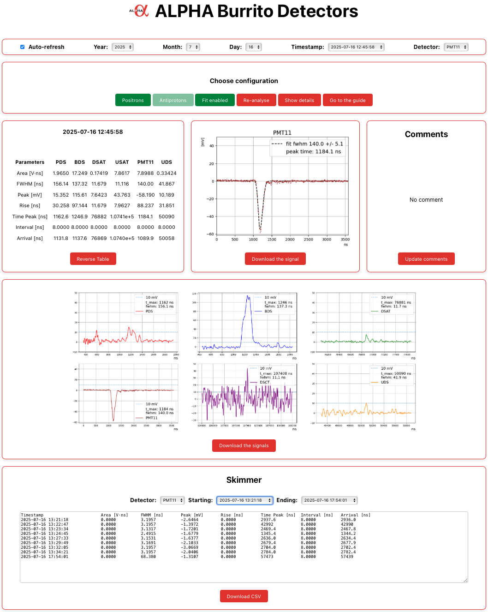

# Alpha Burritos

Alpha Burritos is a modern, interactive React application developed for CERN's ALPHA experiment. It provides researchers and analysts with a user-friendly interface to browse, visualize, and analyze signal data from the experiment's "burrito detectors"—specialized detection systems that capture antimatter annihilation events.

The application communicates with a custom RESTful API to fetch and display critical data, including JSON parameter files and detector-specific PNG images captured at various timestamps. By consolidating multiple data streams into a single, responsive interface, Alpha Burritos simplifies the complex task of antimatter detection analysis and monitoring.

<p align="center">
  
</p>

---

## Features

- **Year/Month/Day Selection:** Choose the year, month, and day to filter available data files.
- **Timestamp Selection:** Select a specific acquisition timestamp from available JSON files.
- **Parameter Display:** View key parameters (area, FWHM, peak, rise, time peak, dt, arrival) for each detector.
- **Combined Image View:** See the combined detector image for the selected acquisition.
- **Detector Selection:** Choose a specific detector (PDS, BDS, DSAT, USAT, PMT11, etc.) to view its processed image.
- **Signal Download:** Download the raw signal as a text file for the selected detector and timestamp.
- **Download All Signals:** Download signal files for all available detectors at once.
- **Comments:** Add and edit comments for specific acquisition files.
- **Auto-Refresh:** Automatically refresh the list of available files.
- **Skimmer:** Browse and export a range of acquisitions and parameters as CSV.
- **Responsive UI:** Built with React and styled for clarity and usability.
- **Authentication:** Secure login for authorized users.
- **Choose Configuration:** Select the analysis mode ("positrons" or "antiprotons") and toggle the fit option for the current session.
- **Re-analyse:** Trigger a new analysis of the currently selected file with the current configuration.

---

## Project Structure

```
src/
  App.jsx                # Main React component
  MainTitle.jsx          # App title and logo
  YearMonthSelector.jsx  # Dropdowns for year/month selection
  TimeStampSelector.jsx  # Dropdown for timestamp/file selection
  Parameters.jsx         # Displays detector parameters from JSON
  DetectorImageAll.jsx   # Shows combined detector image
  DetectorSelector.jsx   # Dropdown for detector selection
  DetectorImage.jsx      # Shows image for selected detector
  DownloadButton.jsx     # Button to download the signal as a text file
  DownloadAllButton.jsx  # Button to download all signals for all detectors
  AutoRefresh.jsx        # Checkbox to enable/disable auto-refresh
  Comment.jsx            # Add and edit comments for each acquisition
  Skimmer.jsx            # Browse and export a range of acquisitions
  LoginForm.jsx          # User authentication form
  assets/                # Static assets (e.g., ALPHA logo)
  CSS/                   # App and global CSS
  main.jsx               # React entry point
```

---

## How It Works

1. **Select Year/Month/Day:**  
   Use the dropdowns to pick a year, month, and day. The app fetches available JSON files for that period.

2. **Select Timestamp:**  
   Choose a file (timestamp) from the dropdown. The app loads its parameters and images.

3. **View Parameters:**  
   The `Parameters` panel displays key values for each detector.

4. **View Images:**  
   - An image containing subplots (one signal per subplot) is shown by default.  
   - Use the "Combined plot" button to switch to a single plot with all signals overlaid.  
   - Use the detector dropdown to view images for individual detectors.

5. **Download Signals:**  
   - Use the "Download the signal" button to download the raw signal for the selected detector.  
   - Use the "Download the signals" button to download signals for all available detectors at once.

6. **Add Comments:**  
   Add notes or observations about specific acquisition files for collaborative research.

7. **Auto-Refresh:**  
   Enable auto-refresh to automatically update the list of available files every 2 seconds.

8. **Skimmer:**  
   Use the Skimmer tool to select a range of acquisitions, view their parameters in tabular form, and export as CSV.

9. **Authentication:**  
   Login is required to access the main features. Credentials are checked via the backend API.

10. **Choose Configuration:**  
    Use the "Choose configuration" panel to select the analysis mode ("positrons" or "antiprotons") and toggle the fit option for the current session.

11. **Re-analyse:**  
    Use the "Re-analyse" button to trigger a new analysis of the currently selected file with the current configuration.

---

## API Endpoints

The React app expects the following backend API (see [`server.js`](server.js)):

- **Test if the API is working:**  
  `GET /api/test`  
  - Returns a JSON file to confirm that the API is working.  
  - Example: `/api/test`  
  - Response:  
    ```json
    { "message": "API is working" }
    ```

- **List JSON Files:**  
  `GET /api/:year/:month/:day/json`  
  - Returns a list of JSON filenames for the specified year, month, and day.  
  - Example: `/api/2025/06/02/json`  
  - Response:  
    ```json
    ["data-2025-06-02_08-25-03.json", "file-2025-06-02.json"]
    ```

- **Get JSON File Content:**  
  `GET /api/json/:jsonFilename`  
  - Returns the parsed JSON content of the specified file.  
  - Example: `/api/json/data-2025-06-02_08-25-03.json`  
  - Response:  
    ```json
    { "PDS": { "area": ..., ... }, ... }
    ```

- **Get Combined Image (single plot, all signals):**  
  `GET /api/img_same/:imageName`  
  - Returns the PNG image with all signals overlaid in a single plot ("Combined plot"). The image is from the `Same` subdirectory.  
  - Example: `/api/img_same/data-2025-06-02_08-25-03.png`  
  - Response:  
    Binary PNG image.

- **Get Subplots Image (default):**  
  `GET /api/img_all/:imageName`  
  - Returns the PNG image containing subplots (one signal per subplot) for all signals. This is the default image shown. The image is from the `Together` subdirectory.  
  - Example: `/api/img_all/data-2025-06-02_08-25-03.png`  
  - Response:  
    Binary PNG image.

- **Get Detector-Specific Image:**  
  `GET /api/img/:detector/:imageName`  
  - Returns the PNG image for a specific detector.  
  - Example: `/api/img/PDS/data-2025-06-02_08-25-03.png`  
  - Response:  
    Binary PNG image.

- **Get Detector-Specific Signal:**  
  `GET /api/signal/:detector/:jsonFilename`  
  - Returns the signal as a text file for a specific detector and JSON file.  
  - Example: `/api/signal/PDS/data-2025-06-02_08-25-03.json`  
  - Response:  
    Text file

- **Get Comments:**  
  `GET /api/comments/:jsonFilename`  
  - Retrieves any saved comments for a specific JSON file.  
  - Example: `/api/comments/data-2025-06-02_08-25-03.json`  
  - Response:  
    ```json
    { "comment": "This detection shows interesting peak values." }
    ```
  - Returns `{ "comment": null }` if no comment exists.

- **Post Comments:**  
  `POST /api/comments/:jsonFilename`  
  - Saves a comment for a specific JSON file.  
  - Example: `/api/comments/data-2025-06-02_08-25-03.json`  
  - Request Body:  
    ```json
    { "comment": "This detection shows interesting peak values." }
    ```
  - Response:  
    ```json
    { "success": true, "message": "Comment updated successfully" }
    ```

- **Get/Update Configuration:**  
  - `GET /api/configuration` — Get the current configuration (from `ANALYSIS_DIR/configuration.json`).
  - `POST /api/configuration` — Update the configuration (expects JSON body).

- **Re-analyse a JSON file:**  
  - `GET /api/reanalyse/:filename` — Triggers a re-analysis for the specified JSON file.

- **Authentication:**  
  - `POST /api/login` — Authenticate user (expects `{ login, password }` in body).
  - `GET /api/profile` — Returns user info if authenticated.

### Additional Endpoints

- **Get Subplots Image:**  
  `GET /api/img_same/:imageName`  
  - Returns the PNG image showing subplots for all signals.  
  - Example: `/api/img_same/data-2025-06-02_08-25-03.png`  
  - Response:  
    Binary PNG image.

- **Get User Profile:**  
  `GET /api/profile`  
  - Returns the authenticated user's profile information.  
  - Example: `/api/profile`  
  - Response:  
    ```json
    { "login": "your_login" }
    ```

### Error Handling

- Returns `404` if a file or image is not found.
- Returns `400` for invalid requests.
- Returns `500` for server errors.

---

### Directory Structure

The API expects files to be organized as:
```
MAIN_DIR/
  YYYY/
    MM/
      DD/
        JSON/
          file-YYYY-MM-DD.json
          comments.json
        Together/
          file-YYYY-MM-DD.png
        PDS/
          file-YYYY-MM-DD.png
          file-YYYY-MM-DD.txt
        BDS/
          file-YYYY-MM-DD.png
          file-YYYY-MM-DD.txt
        ...
```

---

## Development

### Prerequisites

- Node.js (v18+ recommended)
- npm

---

### Install dependencies

```bash
npm install
```

---

### Start the React App

**Development mode:**
```bash
npm run dev
```
The app will be available at [http://localhost:5173](http://localhost:5173) by default.

For production deployments, it is recommended to use a web server such as **NGINX** to serve the built frontend.  
See the [NGINX documentation](https://nginx.org/en/docs/) for setup instructions and configuration examples.

---

### Start the Backend API

You have two options:

**Option 1: Run directly with Node.js** (recommended for development):
```bash
node server.js
```

**Option 2: Run with [PM2](https://pm2.keymetrics.io/)** (recommended for production):
```bash
# Start the server
pm2 start server.js --name burritos

# Save the process list
pm2 save

# Set up PM2 to start on system boot
pm2 startup

# Follow the instructions and run the command output by the previous step
```
- View logs: `pm2 logs burritos`
- Stop the server: `pm2 stop burritos`
- Restart the server: `pm2 restart burritos`

The API will be available at [http://localhost:3001](http://localhost:3001) by default.

---

## Customization

- **API URL:**  
  If your backend runs on a different host or port, update the API URLs in the React components (e.g., `Parameters.jsx`, `DetectorImage.jsx`, etc.).

- **Data Directory and Environment Variables:**  
  The backend expects data in a specific directory structure (see API documentation above).  
  The main directory of the data and other sensitive configuration must be declared in a `.env` file at the project root.

  Example `.env` file:
  ```
  MAIN_DIR=/absolute/path/to/your/data
  ANALYSIS_DIR=/absolute/path/to/your/analysis
  PORT=3001
  USER_LOGIN=your_login
  USER_PASSWORD_HASH=your_bcrypt_hash
  JWT_SECRET=your_jwt_secret
  PYTHON_PATH=/usr/bin/python3
  ```

  - `MAIN_DIR`: Absolute path to the main data directory (required).
  - `ANALYSIS_DIR`: Absolute path to the analysis directory (required).
  - `PORT`: Port for the backend server (default: 3001).
  - `USER_LOGIN`: Username for authentication (required).
  - `USER_PASSWORD_HASH`: Bcrypt hash of the password for authentication (required).
  - `JWT_SECRET`: Secret key for JWT authentication (required).
  - `PYTHON_PATH`: Path to the Python executable used for analysis scripts. If not specified, defaults to `python3`.

  **Note:** Never commit your `.env` file to version control as it may contain sensitive information.

---

## Useful Resources

- [React Documentation](https://react.dev/)
- [Vite Documentation](https://vitejs.dev/guide/)
- [Express Documentation](https://expressjs.com/)
- [Node.js Documentation](https://nodejs.org/en/docs)
- [PM2 documentation](https://pm2.keymetrics.io/)
- [NGINX Documentation](https://nginx.org/en/docs/)
- [JavaScript Reference (MDN)](https://developer.mozilla.org/en-US/docs/Web/JavaScript/Reference)
- [JSON Format](https://www.json.org/json-en.html)
- [RESTful API Design](https://restfulapi.net/)
- [GitHub Guides](https://guides.github.com/)
- [ALPHA Experiment (CERN)](https://home.cern/science/experiments/alpha)

---

This project uses React, Vite, and Express. For backend API details, see [`server.js`](server.js).

---

**Developed by Samuel Niang (Swansea University) and Adriano Del Vincio (Brescia University)**
